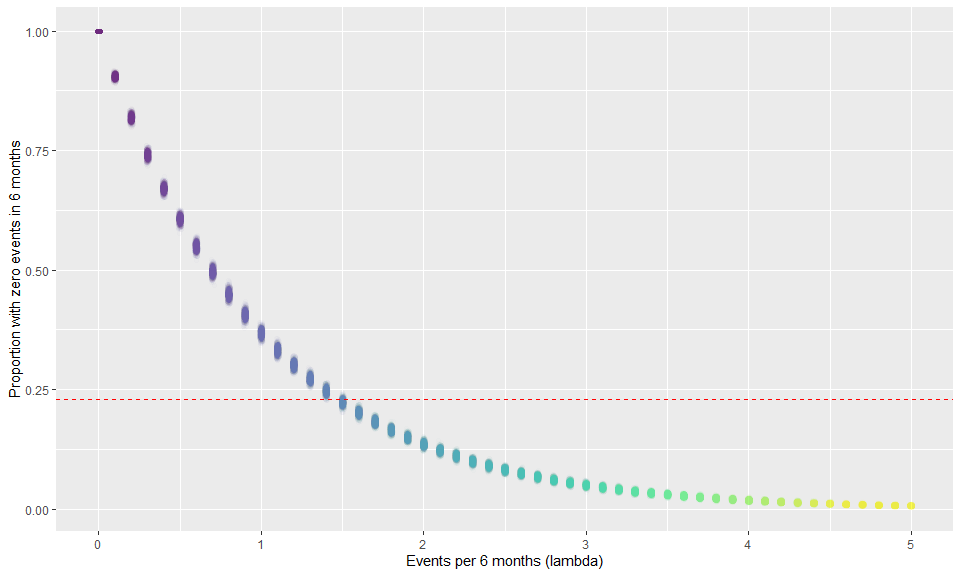
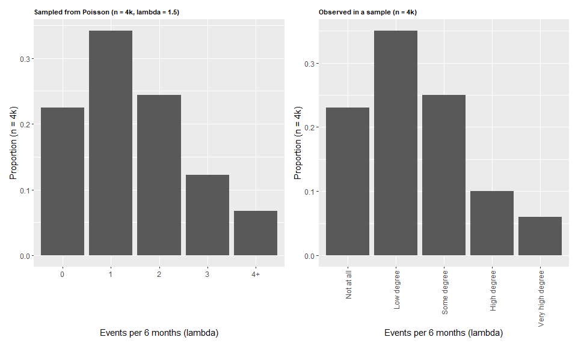

# Sample size

## Background 

Sometimes patients need a stoma, which is where you allow the contents of the digestive system to exit the body before getting to the colon. Urine and feces are then collected in a small bag attached to the body. Leakage of the bag is one of the key factors that affects patient quality of life. The goal of this project is to test new devices (bags) to see if they leak less than currently available devices. 

To design and power the study, we need to have some understanding of how often 
leaks occur, and how much of an improvement we would like to be able to detect in our study (the smallest effect size of interest, assuming it exists).  

The best information I have at this point is a study of a 4k patients who reported how often leaks occurred over 6 month period. Unfortunately, the responses were measured on a 5-level scale indicating that they experienced leaks to "a very high degree" to "not at all". The study found that over 23% of respondents reported no leaks at all over 6 months.  However, what we *really* want to know is a rate - the number of leaks per unit time, so we can model it as a Poisson process (or similarly). 

## Simulating the event rate

So the first step is to see if I can find a reasonable parameterization of a Poisson distribution for a weekly rate that would result in ~23% of people over 6 months not having an event.

To get a handle on this, we repeatedly simulate from a Poisson distribution with 4k observations and various values for lambda (which in this case is the average number of leaks every 6 months). Then, for each of those simulations, we calculate the proportion of observations in the simulated data that has zero events. We are looking for the value of lambda where that proportion is about 0.23. 

<!-- -->

So we can see from the plot above, the value of lambda that results in 23% experiencing no leaks over a 6 month period is 1.5 (i.e. the patients, on average, experience 1.5 leaks per 6 months). 

Now we look at a Poisson distribution with 4k observations and lambda = 1.5 and compare that to the observed distribution of responses in the study of 4k patients. Lo and behold, if we collapse the number of events in our simulated data to 0, 1, 2, 3, and 4+ (e.g. 4, 5, 6, 7, 8), the distribution actually matches up pretty well to the scale reported in the study. 

<!-- -->
However, there is one problem, which is that "high degree" would have to equate to 3 events every 6 months for this to make sense; and very high degree would mean between 4 and 8 events in 6 months. I seriously doubt that is the case. So what we really need from these people is to get a better idea of what this event rate might actually be. What I do know, is that it's can't be, on average, once a week (or thereabouts) and still wind up with 23% never having a leak in a 6 month period. 
